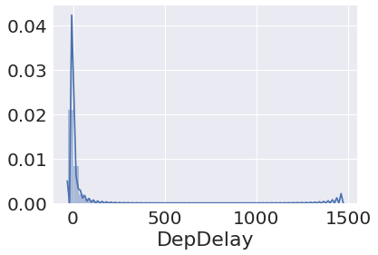
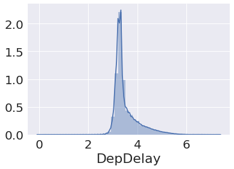
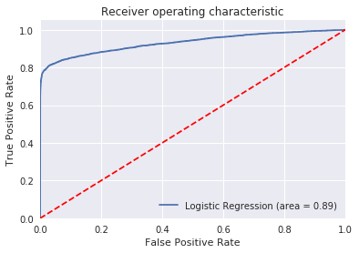
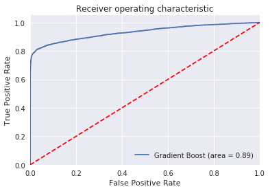
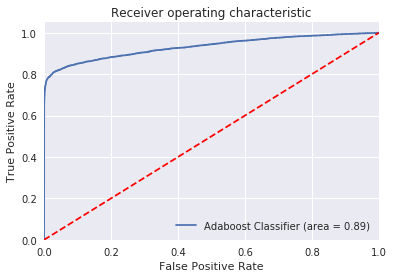

# 1) Get Data


```python
!pip install xgboost
!pip install tabulate
!pip install imblearn
# # jupyter contrib nbextension install --user
# !jupyter nbextension enable toc2/main
# !jupyter labextension install @jupyterlab/toc
```

    Requirement already satisfied: xgboost in /home/ec2-user/anaconda3/envs/tensorflow_p36/lib/python3.6/site-packages (0.81)
    Requirement already satisfied: scipy in /home/ec2-user/anaconda3/envs/tensorflow_p36/lib/python3.6/site-packages (from xgboost) (1.1.0)
    Requirement already satisfied: numpy in /home/ec2-user/anaconda3/envs/tensorflow_p36/lib/python3.6/site-packages (from xgboost) (1.14.5)
    You are using pip version 10.0.1, however version 19.0.3 is available.
    You should consider upgrading via the 'pip install --upgrade pip' command.
    Requirement already satisfied: tabulate in /home/ec2-user/anaconda3/envs/tensorflow_p36/lib/python3.6/site-packages (0.8.3)
    You are using pip version 10.0.1, however version 19.0.3 is available.
    You should consider upgrading via the 'pip install --upgrade pip' command.
    Requirement already satisfied: imblearn in /home/ec2-user/anaconda3/envs/tensorflow_p36/lib/python3.6/site-packages (0.0)
    Requirement already satisfied: imbalanced-learn in /home/ec2-user/anaconda3/envs/tensorflow_p36/lib/python3.6/site-packages (from imblearn) (0.4.3)
    Requirement already satisfied: scipy>=0.13.3 in /home/ec2-user/anaconda3/envs/tensorflow_p36/lib/python3.6/site-packages (from imbalanced-learn->imblearn) (1.1.0)
    Requirement already satisfied: numpy>=1.8.2 in /home/ec2-user/anaconda3/envs/tensorflow_p36/lib/python3.6/site-packages (from imbalanced-learn->imblearn) (1.14.5)
    Requirement already satisfied: scikit-learn>=0.20 in /home/ec2-user/anaconda3/envs/tensorflow_p36/lib/python3.6/site-packages (from imbalanced-learn->imblearn) (0.20.2)
    You are using pip version 10.0.1, however version 19.0.3 is available.
    You should consider upgrading via the 'pip install --upgrade pip' command.


```python
# %matplotlib inline
from datetime import datetime
from imblearn.over_sampling import SMOTE, ADASYN
from IPython.core.pylabtools import figsize
from matplotlib import pyplot as plt
from scipy.stats import randint as sp_randint
from sklearn import datasets
from sklearn import linear_model, decomposition, datasets
from sklearn import metrics
from sklearn import preprocessing
from sklearn import svm
from sklearn.datasets import load_iris
from sklearn.decomposition import PCA
from sklearn.ensemble import RandomForestClassifier
from sklearn.ensemble import RandomForestClassifier, GradientBoostingClassifier, AdaBoostClassifier
from sklearn.ensemble import RandomForestRegressor, GradientBoostingRegressor
from sklearn.externals import joblib
from sklearn.feature_selection import VarianceThreshold
from sklearn.linear_model import LinearRegression
from sklearn.linear_model import LogisticRegression
from sklearn.linear_model import SGDClassifier
from sklearn.metrics import accuracy_score
from sklearn.metrics import classification_report
from sklearn.metrics import confusion_matrix
from sklearn.metrics import confusion_matrix, accuracy_score, average_precision_score
from sklearn.metrics import f1_score, precision_score, recall_score
from sklearn.metrics import mean_squared_error, cohen_kappa_score, make_scorer
from sklearn.metrics import precision_recall_curve, SCORERS
from sklearn.metrics import precision_score, recall_score, accuracy_score, f1_score
from sklearn.metrics import roc_auc_score, roc_curve, auc, classification_report
from sklearn.metrics import roc_curve, auc
from sklearn.mixture import GaussianMixture
from sklearn.model_selection import cross_val_score, train_test_split
from sklearn.model_selection import GridSearchCV
from sklearn.model_selection import learning_curve
from sklearn.model_selection import RandomizedSearchCV, GridSearchCV
from sklearn.model_selection import ShuffleSplit
from sklearn.model_selection import train_test_split
from sklearn.multiclass import OneVsRestClassifier
from sklearn.neighbors import KNeighborsRegressor
from sklearn.pipeline import Pipeline
from sklearn.preprocessing import Imputer, MinMaxScaler
from sklearn.preprocessing import OneHotEncoder
from sklearn.preprocessing import StandardScaler
from sklearn.svm import SVC
from sklearn.svm import SVR
from sklearn.tree import DecisionTreeClassifier
from tabulate import tabulate
from xgboost import XGBClassifier
import matplotlib
import matplotlib.pyplot as plt
import numpy as np
import pandas as pd
import pickle
import seaborn as sns
import sklearn
import time
import xgboost
matplotlib.style.use('ggplot')
pd.options.mode.chained_assignment = None
plt.rcParams['font.size'] = 24
scaler = preprocessing.StandardScaler()
sns.set(font_scale = 2)

pd.set_option('display.max_rows', 500)
pd.set_option('display.max_columns', 40)
```


```python
# df = pd.read_csv("./dataframe.csv")
df = pd.read_pickle("dataframe.pkl")
df.head() # shape = (278220, 35)
# df.info() #(total 36 columns):
```


<div>
<style scoped>
    .dataframe tbody tr th:only-of-type {
        vertical-align: middle;
    }

    .dataframe tbody tr th {
        vertical-align: top;
    }

    .dataframe thead th {
        text-align: right;
    }
</style>
<table border="1" class="dataframe">
  <thead>
    <tr style="text-align: right;">
      <th></th>
      <th>Year</th>
      <th>Month</th>
      <th>Day</th>
      <th>hour</th>
      <th>pressure</th>
      <th>humidity</th>
      <th>temperature</th>
      <th>wind_direction</th>
      <th>wind_speed</th>
      <th>description</th>
      <th>Origin</th>
      <th>Flights</th>
      <th>Dest</th>
      <th>DepTime</th>
      <th>DepDelay</th>
      <th>DepDelayMinutes</th>
      <th>DepDel15</th>
      <th>CRSDepTime</th>
      <th>Distance</th>
      <th>DepartureDelayGroups</th>
      <th>TaxiOut</th>
      <th>TaxiIn</th>
      <th>ArrTime</th>
      <th>ArrDelay</th>
      <th>Cancelled</th>
      <th>Diverted</th>
      <th>AirTime</th>
      <th>Distance</th>
      <th>CarrierDelay</th>
      <th>WeatherDelay</th>
      <th>NASDelay</th>
      <th>SecurityDelay</th>
      <th>LateAircraftDelay</th>
      <th>CancellationCode</th>
      <th>FlightNum</th>
      <th>SchedDepartTime</th>
    </tr>
  </thead>
  <tbody>
    <tr>
      <th>0</th>
      <td>2015.0</td>
      <td>1.0</td>
      <td>1.0</td>
      <td>5</td>
      <td>1043.0</td>
      <td>80.0</td>
      <td>273.207333</td>
      <td>317.0</td>
      <td>1.0</td>
      <td>few clouds</td>
      <td>ATL</td>
      <td>1.0</td>
      <td>IAD</td>
      <td>556.0</td>
      <td>16.0</td>
      <td>16.0</td>
      <td>1.0</td>
      <td>540</td>
      <td>534.0</td>
      <td>1.0</td>
      <td>9.0</td>
      <td>15.0</td>
      <td>739.0</td>
      <td>14.0</td>
      <td>0.0</td>
      <td>0.0</td>
      <td>79.0</td>
      <td>534.0</td>
      <td>0.0</td>
      <td>0.0</td>
      <td>0.0</td>
      <td>0.0</td>
      <td>0.0</td>
      <td>0</td>
      <td>EV3268</td>
      <td>540.0</td>
    </tr>
    <tr>
      <th>1</th>
      <td>2015.0</td>
      <td>1.0</td>
      <td>1.0</td>
      <td>6</td>
      <td>1043.0</td>
      <td>80.0</td>
      <td>272.990000</td>
      <td>329.0</td>
      <td>1.0</td>
      <td>sky is clear</td>
      <td>ATL</td>
      <td>1.0</td>
      <td>MIA</td>
      <td>656.0</td>
      <td>-4.0</td>
      <td>0.0</td>
      <td>0.0</td>
      <td>700</td>
      <td>594.0</td>
      <td>-1.0</td>
      <td>15.0</td>
      <td>9.0</td>
      <td>842.0</td>
      <td>-10.0</td>
      <td>0.0</td>
      <td>0.0</td>
      <td>82.0</td>
      <td>594.0</td>
      <td>0.0</td>
      <td>0.0</td>
      <td>0.0</td>
      <td>0.0</td>
      <td>0.0</td>
      <td>0</td>
      <td>AA17</td>
      <td>660.0</td>
    </tr>
    <tr>
      <th>2</th>
      <td>2015.0</td>
      <td>1.0</td>
      <td>1.0</td>
      <td>6</td>
      <td>1043.0</td>
      <td>80.0</td>
      <td>272.990000</td>
      <td>329.0</td>
      <td>1.0</td>
      <td>sky is clear</td>
      <td>ATL</td>
      <td>1.0</td>
      <td>LGA</td>
      <td>644.0</td>
      <td>-1.0</td>
      <td>0.0</td>
      <td>0.0</td>
      <td>645</td>
      <td>762.0</td>
      <td>-1.0</td>
      <td>31.0</td>
      <td>9.0</td>
      <td>901.0</td>
      <td>8.0</td>
      <td>0.0</td>
      <td>0.0</td>
      <td>97.0</td>
      <td>762.0</td>
      <td>0.0</td>
      <td>0.0</td>
      <td>0.0</td>
      <td>0.0</td>
      <td>0.0</td>
      <td>0</td>
      <td>DL886</td>
      <td>645.0</td>
    </tr>
    <tr>
      <th>3</th>
      <td>2015.0</td>
      <td>1.0</td>
      <td>1.0</td>
      <td>6</td>
      <td>1043.0</td>
      <td>80.0</td>
      <td>272.990000</td>
      <td>329.0</td>
      <td>1.0</td>
      <td>sky is clear</td>
      <td>ATL</td>
      <td>1.0</td>
      <td>MCO</td>
      <td>654.0</td>
      <td>-1.0</td>
      <td>0.0</td>
      <td>0.0</td>
      <td>655</td>
      <td>404.0</td>
      <td>-1.0</td>
      <td>14.0</td>
      <td>8.0</td>
      <td>815.0</td>
      <td>-7.0</td>
      <td>0.0</td>
      <td>0.0</td>
      <td>59.0</td>
      <td>404.0</td>
      <td>0.0</td>
      <td>0.0</td>
      <td>0.0</td>
      <td>0.0</td>
      <td>0.0</td>
      <td>0</td>
      <td>DL1818</td>
      <td>655.0</td>
    </tr>
    <tr>
      <th>4</th>
      <td>2015.0</td>
      <td>1.0</td>
      <td>1.0</td>
      <td>6</td>
      <td>1043.0</td>
      <td>80.0</td>
      <td>272.990000</td>
      <td>329.0</td>
      <td>1.0</td>
      <td>sky is clear</td>
      <td>ATL</td>
      <td>1.0</td>
      <td>CLT</td>
      <td>658.0</td>
      <td>-2.0</td>
      <td>0.0</td>
      <td>0.0</td>
      <td>700</td>
      <td>226.0</td>
      <td>-1.0</td>
      <td>15.0</td>
      <td>10.0</td>
      <td>801.0</td>
      <td>-11.0</td>
      <td>0.0</td>
      <td>0.0</td>
      <td>38.0</td>
      <td>226.0</td>
      <td>0.0</td>
      <td>0.0</td>
      <td>0.0</td>
      <td>0.0</td>
      <td>0.0</td>
      <td>0</td>
      <td>US461</td>
      <td>660.0</td>
    </tr>
  </tbody>
</table>
</div>


```python
df = df.loc[:,~df.columns.duplicated()]
df=df[['DepDelay','hour', 'pressure', 'humidity', 'temperature', 'wind_speed', 'description', 'Origin', 'Dest', 'DepTime', 'Distance', 'ArrTime','AirTime','CarrierDelay', 'WeatherDelay', 'NASDelay', 'SecurityDelay','LateAircraftDelay', 'CancellationCode']]
# df['DATE'] = pd.to_datetime(df[['Year','Month', 'Day']])
# df=df[['DepDelay','hour', 'pressure', 'humidity', 'temperature', 'wind_speed', 'description', 'Origin', 'Dest', 'DepTime', 'Distance', 'ArrTime','AirTime']]
# df=df[df["Origin"]=="ATL"]
```


```python
df.info() #total 19 columns
```

    <class 'pandas.core.frame.DataFrame'>
    Int64Index: 278220 entries, 0 to 50722
    Data columns (total 16 columns):
    DepDelay             278220 non-null float64
    hour                 278220 non-null int64
    pressure             278220 non-null float64
    humidity             278220 non-null float64
    temperature          278220 non-null float64
    wind_speed           278220 non-null float64
    description          278220 non-null object
    Origin               278220 non-null object
    Dest                 278220 non-null object
    Distance             278220 non-null float64
    CarrierDelay         278220 non-null float64
    WeatherDelay         278220 non-null float64
    NASDelay             278220 non-null float64
    SecurityDelay        278220 non-null float64
    LateAircraftDelay    278220 non-null float64
    CancellationCode     278220 non-null int64
    dtypes: float64(11), int64(2), object(3)
    memory usage: 46.1+ MB


```python
# #Create the plot in seaborn
# # plt.figure(figsize=(8, 2))
# g = sns.violinplot(x="Dest", y="DepDelay", data=df[:200],palette="coolwarm")
# g.set_ylabel('Delay')
# g.set_xlabel('')
# label = g.set_xticklabels(g.get_xticklabels(), rotation=90)
# fig = g.get_figure()
# fig.savefig("delay_violin_plot.png", bbox_inches='tight')
```

# Remove Collinear Features


```python
def remove_collinear_features(x, threshold):
    '''
    Objective:
        Remove collinear features in a dataframe with a correlation coefficient
        greater than the threshold. Removing collinear features can help a model
        to generalize and improves the interpretability of the model.
        
    Inputs: 
        threshold: any features with correlations greater than this value are removed
    
    Output: 
        dataframe that contains only the non-highly-collinear features
    '''
#     y = df['DepDelay']
    # Dont want to remove correlations between Energy Star Score
    y = df['DepDelay']
    x = df.drop(columns = ['DepDelay'])
    
    # Calculate the correlation matrix
    corr_matrix = x.corr()
    iters = range(len(corr_matrix.columns) - 1)
    drop_cols = []

    # Iterate through the correlation matrix and compare correlations
    for i in iters:
        for j in range(i):
            item = corr_matrix.iloc[j:(j+1), (i+1):(i+2)]
            col = item.columns
            row = item.index
            val = abs(item.values)
            
            # If correlation exceeds the threshold
            if val >= threshold:
                # Print the correlated features and the correlation value
                # print(col.values[0], "|", row.values[0], "|", round(val[0][0], 2))
                drop_cols.append(col.values[0])

    # Drop one of each pair of correlated columns
    drops = set(drop_cols)
    x = df.drop(columns = drops)
#     x = df.drop(columns = ['hour', 'pressure', 'humidity', 'temperature', 'wind_speed',
#        'description', 'Origin', 'Dest', 'DepTime', 'Distance', 'ArrTime',
#        'AirTime'])
    
    # Add the score back in to the data
    x['DepDelay'] = y
               
    return x

df = remove_collinear_features(df, 0.6);
y = df['DepDelay']
X = df.drop(columns = ['DepDelay'])

```


```python
X.info()
```

    <class 'pandas.core.frame.DataFrame'>
    Int64Index: 278220 entries, 0 to 50722
    Data columns (total 15 columns):
    hour                 278220 non-null int64
    pressure             278220 non-null float64
    humidity             278220 non-null float64
    temperature          278220 non-null float64
    wind_speed           278220 non-null float64
    description          278220 non-null object
    Origin               278220 non-null object
    Dest                 278220 non-null object
    Distance             278220 non-null float64
    CarrierDelay         278220 non-null float64
    WeatherDelay         278220 non-null float64
    NASDelay             278220 non-null float64
    SecurityDelay        278220 non-null float64
    LateAircraftDelay    278220 non-null float64
    CancellationCode     278220 non-null int64
    dtypes: float64(10), int64(2), object(3)
    memory usage: 34.0+ MB


# Analyze Skewness of data


```python
#histogram to figure out skewness
sns.distplot(y)
plt.show()
# delays are mostly located on the left side of the graph, with a long tail to the right 
print("Skewness: %f" % y.skew())
print("Kurtosis: %f" % y.kurt())
```

    /home/ec2-user/anaconda3/envs/tensorflow_p36/lib/python3.6/site-packages/matplotlib/axes/_axes.py:6462: UserWarning: The 'normed' kwarg is deprecated, and has been replaced by the 'density' kwarg.
      warnings.warn("The 'normed' kwarg is deprecated, and has been "





    Skewness: 7.769452
    Kurtosis: 123.662668


# Taking log of flight delays and transform to account for negative values


```python
#taking log of flight delays and making the lowest value equal to 1 since there are negative numbers 
z = np.log(y + 1 - min(df['DepDelay']))# 
z.describe()
# z.tail()
sns.distplot(z)
plt.show()
#skew and Kurtosis are much better to modle on now 
print("Skewness: %f" % z.skew())
print("Kurtosis: %f" % z.kurt())
```

    /home/ec2-user/anaconda3/envs/tensorflow_p36/lib/python3.6/site-packages/matplotlib/axes/_axes.py:6462: UserWarning: The 'normed' kwarg is deprecated, and has been replaced by the 'density' kwarg.
      warnings.warn("The 'normed' kwarg is deprecated, and has been "





    Skewness: 1.885669
    Kurtosis: 4.051972


```python
# # #scatterplot
# sns.set()
# cols = ['DepDelay', 'CarrierDelay', 'LateAircraftDelay', 'NASDelay', 'WeatherDelay']
# sns.pairplot(df[cols], size = 2.5)
# plt.show()
```


```python
features123=X
categorical_subset = features123[['Origin','Dest','description', 'CarrierDelay',
       'WeatherDelay', 'NASDelay', 'SecurityDelay', 'LateAircraftDelay',
       'CancellationCode']]
numeric_subset=features123[['hour', 'pressure', 'humidity', 'temperature', 'wind_speed', 'Distance']]
numeric_subset_columns=['hour', 'pressure', 'humidity', 'temperature', 'wind_speed', 'Distance']
# One hot encode

categorical_subset = pd.get_dummies(categorical_subset)
#normalize categorical 
numeric_subset = numeric_subset[numeric_subset_columns].apply(lambda x: (x - x.min()) / (x.max() - x.min()))
# numeric_subset

# Join the two dataframes using concat
# Make sure to use axis = 1 to perform a column bind
features1234 = pd.concat([numeric_subset, categorical_subset], axis = 1)

print(features1234.info())
print(features1234.describe())
```

    <class 'pandas.core.frame.DataFrame'>
    Int64Index: 278220 entries, 0 to 50722
    Columns: 290 entries, hour to description_very heavy rain
    dtypes: float64(11), int64(1), uint8(278)
    memory usage: 101.4 MB
    None
                    hour       pressure       humidity    temperature  \
    count  278220.000000  278220.000000  278220.000000  278220.000000   
    mean        0.605044       0.682790       0.699510       0.509982   
    std         0.205597       0.102464       0.230999       0.163319   
    min         0.000000       0.000000       0.000000       0.000000   
    25%         0.434783       0.611570       0.526882       0.405872   
    50%         0.608696       0.677686       0.720430       0.507827   
    75%         0.782609       0.760331       0.913978       0.618553   
    max         1.000000       1.000000       1.000000       1.000000   
    
              wind_speed       Distance  CarrierDelay   WeatherDelay  \
    count  278220.000000  278220.000000  278220.00000  278220.000000   
    mean        0.191611       0.155046       4.61010       1.001610   
    std         0.124864       0.108768      23.53976      13.352123   
    min         0.000000       0.000000       0.00000       0.000000   
    25%         0.117647       0.078692       0.00000       0.000000   
    50%         0.176471       0.129425       0.00000       0.000000   
    75%         0.235294       0.198196       0.00000       0.000000   
    max         1.000000       1.000000    1217.00000    1329.000000   
    
                NASDelay  SecurityDelay  LateAircraftDelay  CancellationCode  \
    count  278220.000000  278220.000000      278220.000000          278220.0   
    mean        2.678610       0.009241           4.101190               0.0   
    std        12.565422       0.593218          19.550369               0.0   
    min         0.000000       0.000000           0.000000               0.0   
    25%         0.000000       0.000000           0.000000               0.0   
    50%         0.000000       0.000000           0.000000               0.0   
    75%         0.000000       0.000000           0.000000               0.0   
    max       834.000000     123.000000        1175.000000               0.0   
    
              Origin_ATL     Origin_CLT     Origin_DEN     Origin_DFW  \
    count  278220.000000  278220.000000  278220.000000  278220.000000   
    mean        0.316372       0.095856       0.182313       0.193746   
    std         0.465061       0.294394       0.386103       0.395233   
    min         0.000000       0.000000       0.000000       0.000000   
    25%         0.000000       0.000000       0.000000       0.000000   
    50%         0.000000       0.000000       0.000000       0.000000   
    75%         1.000000       0.000000       0.000000       0.000000   
    max         1.000000       1.000000       1.000000       1.000000   
    
              Origin_ORD       Dest_ABE       Dest_ABI       Dest_ABQ  \
    count  278220.000000  278220.000000  278220.000000  278220.000000   
    mean        0.211714       0.001125       0.000913       0.003454   
    std         0.408524       0.033522       0.030201       0.058670   
    min         0.000000       0.000000       0.000000       0.000000   
    25%         0.000000       0.000000       0.000000       0.000000   
    50%         0.000000       0.000000       0.000000       0.000000   
    75%         0.000000       0.000000       0.000000       0.000000   
    max         1.000000       1.000000       1.000000       1.000000   
    
                      ...               description_freezing rain  \
    count             ...                           278220.000000   
    mean              ...                                0.000119   
    std               ...                                0.010890   
    min               ...                                0.000000   
    25%               ...                                0.000000   
    50%               ...                                0.000000   
    75%               ...                                0.000000   
    max               ...                                1.000000   
    
           description_haze  description_heavy intensity drizzle  \
    count     278220.000000                        278220.000000   
    mean           0.021914                             0.000837   
    std            0.146404                             0.028927   
    min            0.000000                             0.000000   
    25%            0.000000                             0.000000   
    50%            0.000000                             0.000000   
    75%            0.000000                             0.000000   
    max            1.000000                             1.000000   
    
           description_heavy intensity rain  description_heavy snow  \
    count                     278220.000000           278220.000000   
    mean                           0.016235                0.000557   
    std                            0.126380                0.023597   
    min                            0.000000                0.000000   
    25%                            0.000000                0.000000   
    50%                            0.000000                0.000000   
    75%                            0.000000                0.000000   
    max                            1.000000                1.000000   
    
           description_light intensity drizzle  description_light rain  \
    count                        278220.000000           278220.000000   
    mean                              0.008874                0.057415   
    std                               0.093785                0.232634   
    min                               0.000000                0.000000   
    25%                               0.000000                0.000000   
    50%                               0.000000                0.000000   
    75%                               0.000000                0.000000   
    max                               1.000000                1.000000   
    
           description_light snow  description_mist  description_moderate rain  \
    count           278220.000000     278220.000000              278220.000000   
    mean                 0.043300          0.083973                   0.014805   
    std                  0.203533          0.277348                   0.120771   
    min                  0.000000          0.000000                   0.000000   
    25%                  0.000000          0.000000                   0.000000   
    50%                  0.000000          0.000000                   0.000000   
    75%                  0.000000          0.000000                   0.000000   
    max                  1.000000          1.000000                   1.000000   
    
           description_overcast clouds  description_proximity shower rain  \
    count                278220.000000                      278220.000000   
    mean                      0.084138                           0.000266   
    std                       0.277596                           0.016307   
    min                       0.000000                           0.000000   
    25%                       0.000000                           0.000000   
    50%                       0.000000                           0.000000   
    75%                       0.000000                           0.000000   
    max                       1.000000                           1.000000   
    
           description_proximity thunderstorm  description_scattered clouds  \
    count                       278220.000000                 278220.000000   
    mean                             0.000536                      0.072914   
    std                              0.023136                      0.259995   
    min                              0.000000                      0.000000   
    25%                              0.000000                      0.000000   
    50%                              0.000000                      0.000000   
    75%                              0.000000                      0.000000   
    max                              1.000000                      1.000000   
    
           description_sky is clear  description_smoke  description_snow  \
    count             278220.000000      278220.000000     278220.000000   
    mean                   0.402631           0.000169          0.014726   
    std                    0.490429           0.012996          0.120453   
    min                    0.000000           0.000000          0.000000   
    25%                    0.000000           0.000000          0.000000   
    50%                    0.000000           0.000000          0.000000   
    75%                    1.000000           0.000000          0.000000   
    max                    1.000000           1.000000          1.000000   
    
           description_thunderstorm  description_thunderstorm with rain  \
    count             278220.000000                       278220.000000   
    mean                   0.000104                            0.000482   
    std                    0.010209                            0.021941   
    min                    0.000000                            0.000000   
    25%                    0.000000                            0.000000   
    50%                    0.000000                            0.000000   
    75%                    0.000000                            0.000000   
    max                    1.000000                            1.000000   
    
           description_very heavy rain  
    count                278220.000000  
    mean                      0.000018  
    std                       0.004239  
    min                       0.000000  
    25%                       0.000000  
    50%                       0.000000  
    75%                       0.000000  
    max                       1.000000  
    
    [8 rows x 290 columns]


```python
features = features1234 #(278220, 13)
targets = z #pd.DataFrame(y)  #278220,)
min_value=min(df['DepDelay'])
print(features.shape)
print(targets.shape)
print(min_value)           
```

    (278220, 290)
    (278220,)
    -28.0


```python
# changing to binary Where anything greater than 15 minutes delayed is a 1 and anything else (including negative is a 0)
#taking the log due to skewness but have to add 1 and less the min value becuase some values are negative
def delay(targets):
    if targets > np.log(15 + 1 - min_value): # 3.784: #variable= np.log(15 + 1 - -28))  value is the value of 15 using the log transformation from above  
        return 1
    else:
        return 0
targets=targets.apply(delay)
```


```python
print(targets.shape)
print(features.shape)
```

    (278220,)
    (278220, 290)


# Models LogisticRegression:  accuracy is 0.9466968586011071


```python
x_train4, x_val4, y_train4, y_val4 = train_test_split(features, targets,test_size = .1,random_state=12)
logreg = LogisticRegression(fit_intercept = False, C = 1e12) #Starter code
model = logreg.fit(x_train4,y_train4)

#Predict
y_pred4=model.predict(x_val4)
print('Accuracy of logistic regression classifier on test set: {:.2f}'.format(model.score(x_val4, y_val4)))
# print(classification_report(y_val4, y_pred4))
print(confusion_matrix(y_pred4,y_val4))
# Accuracy score
print('accuracy is',accuracy_score(y_pred4,y_val4))
```

    /home/ec2-user/anaconda3/envs/tensorflow_p36/lib/python3.6/site-packages/sklearn/linear_model/logistic.py:433: FutureWarning: Default solver will be changed to 'lbfgs' in 0.22. Specify a solver to silence this warning.
      FutureWarning)


    Accuracy of logistic regression classifier on test set: 0.95
    [[22021  1184]
     [  299  4318]]
    accuracy is 0.9466968586011071


```python
X_train,X_test,y_train,y_test=x_train4, x_val4, y_train4, y_val4
logit_roc_auc = roc_auc_score(y_test, model.predict(X_test))
fpr, tpr, thresholds = roc_curve(y_test, model.predict_proba(X_test)[:,1])
plt.figure()
plt.plot(fpr, tpr, label='Logistic Regression (area = %0.2f)' % logit_roc_auc)
plt.plot([0, 1], [0, 1],'r--')
plt.xlim([0.0, 1.0])
plt.ylim([0.0, 1.05])
plt.xlabel('False Positive Rate')
plt.ylabel('True Positive Rate')
plt.title('Receiver operating characteristic')
plt.legend(loc="lower right")
plt.savefig('Log_ROC')
plt.show()
```





# Model RandomForestClassifier(n_estimators=130): accuracy is 0.9514053626626411


```python
x_train6, x_val6, y_train6, y_val6 = train_test_split(features, targets,test_size = .1,random_state=12)

clf_rf = RandomForestClassifier(n_estimators=130, random_state=12)
clf_rf.fit(x_train6, y_train6)
```


    RandomForestClassifier(bootstrap=True, class_weight=None, criterion='gini',
                max_depth=None, max_features='auto', max_leaf_nodes=None,
                min_impurity_decrease=0.0, min_impurity_split=None,
                min_samples_leaf=1, min_samples_split=2,
                min_weight_fraction_leaf=0.0, n_estimators=130, n_jobs=None,
                oob_score=False, random_state=12, verbose=0, warm_start=False)


```python
#Predict
y_pred6=clf_rf.predict(x_val6)
print(classification_report(y_val6, y_pred6))
print(confusion_matrix(y_pred6,y_val6))
# Accuracy score
print('accuracy is',accuracy_score(y_pred6,y_val6))
```

                  precision    recall  f1-score   support
    
               0       0.95      0.99      0.97     22320
               1       0.95      0.80      0.87      5502
    
       micro avg       0.95      0.95      0.95     27822
       macro avg       0.95      0.89      0.92     27822
    weighted avg       0.95      0.95      0.95     27822
    
    [[22086  1118]
     [  234  4384]]
    accuracy is 0.9514053626626411


# GradientBoostingClassifier: accuracy is 0.9553590683631659


```python
from sklearn.ensemble import GradientBoostingClassifier
x_train5, x_val5, y_train5, y_val5 = train_test_split(features, targets,test_size = .1,random_state=12)

model5=GradientBoostingClassifier()
model5.fit(x_train5,y_train5) #(x_train_res,y_train_res)
```


    GradientBoostingClassifier(criterion='friedman_mse', init=None,
                  learning_rate=0.1, loss='deviance', max_depth=3,
                  max_features=None, max_leaf_nodes=None,
                  min_impurity_decrease=0.0, min_impurity_split=None,
                  min_samples_leaf=1, min_samples_split=2,
                  min_weight_fraction_leaf=0.0, n_estimators=100,
                  n_iter_no_change=None, presort='auto', random_state=None,
                  subsample=1.0, tol=0.0001, validation_fraction=0.1,
                  verbose=0, warm_start=False)


```python
#Predict
y_pred5=model5.predict(x_val5)
print(classification_report(y_val5, y_pred5))
print(confusion_matrix(y_pred5,y_val5))
# Accuracy score
print('accuracy is',accuracy_score(y_pred5,y_val5))
```

                  precision    recall  f1-score   support
    
               0       0.95      1.00      0.97     22320
               1       0.98      0.79      0.87      5502
    
       micro avg       0.96      0.96      0.96     27822
       macro avg       0.97      0.89      0.92     27822
    weighted avg       0.96      0.96      0.95     27822
    
    [[22238  1160]
     [   82  4342]]
    accuracy is 0.9553590683631659


```python
X_train,X_test,y_train,y_test=x_train5, x_val5, y_train5, y_val5
logit_roc_auc = roc_auc_score(y_test, model.predict(X_test))
fpr, tpr, thresholds = roc_curve(y_test, model.predict_proba(X_test)[:,1])
plt.figure()
plt.plot(fpr, tpr, label='Gradient Boost (area = %0.2f)' % logit_roc_auc)
plt.plot([0, 1], [0, 1],'r--')
plt.xlim([0.0, 1.0])
plt.ylim([0.0, 1.05])
plt.xlabel('False Positive Rate')
plt.ylabel('True Positive Rate')
plt.title('Receiver operating characteristic')
plt.legend(loc="lower right")
plt.savefig('Log_ROC')
plt.show()
```





# AdaBoostClassifier: accuracy is 0.9520523326863634


```python
from sklearn.ensemble import AdaBoostClassifier
x_train9, x_val9, y_train9, y_val9 = train_test_split(features, targets,test_size = .1,random_state=12)

model9=AdaBoostClassifier()
model9.fit(x_train9,y_train9) #(x_train_res,y_train_res)
#Predict
y_pred9=model9.predict(x_val9)
print(classification_report(y_val9, y_pred9))
print(confusion_matrix(y_pred9,y_val9))
# Accuracy score
print('accuracy is',accuracy_score(y_pred9,y_val9))
```

                  precision    recall  f1-score   support
    
               0       0.95      1.00      0.97     22320
               1       0.98      0.78      0.86      5502
    
       micro avg       0.95      0.95      0.95     27822
       macro avg       0.96      0.89      0.92     27822
    weighted avg       0.95      0.95      0.95     27822
    
    [[22220  1234]
     [  100  4268]]
    accuracy is 0.9520523326863634


```python
X_train,X_test,y_train,y_test=x_train9, x_val9, y_train9, y_val9
logit_roc_auc = roc_auc_score(y_test, model.predict(X_test))
fpr, tpr, thresholds = roc_curve(y_test, model.predict_proba(X_test)[:,1])
plt.figure()
plt.plot(fpr, tpr, label='Adaboost Classifier (area = %0.2f)' % logit_roc_auc)
plt.plot([0, 1], [0, 1],'r--')
plt.xlim([0.0, 1.0])
plt.ylim([0.0, 1.05])
plt.xlabel('False Positive Rate')
plt.ylabel('True Positive Rate')
plt.title('Receiver operating characteristic')
plt.legend(loc="lower right")
plt.savefig('Log_ROC')
plt.show()
```





# Models: SMOTE Random Forest and GradientBoosting
# 1)Gradient and Smote Accuracy is 0.9518007332
# 2)Random Forest and Smote Accuracy is 0.951585076


```python
ones=y_train[y_train==1].count()
print(ones)
zeross=y_train[y_train==0].count()
print(zeross)
```

    49940
    200458


```python
#smote only on the training features because of large class imbalance
X_train10, X_test10, y_train10, y_test10 = train_test_split(features, targets, test_size = 0.1, random_state = 42)
sm = SMOTE(k_neighbors=5, kind = 'regular', ratio='auto')#(random_state=12, ratio = 1.0)
x_train_res10, y_train_res10 = sm.fit_sample(X_train10, y_train10)
```


```python
model6=GradientBoostingClassifier()
model6.fit(x_train_res10,y_train_res10) #(x_train_res,y_train_res)
#Predict
y_pred16=model6.predict(X_test10)
print(classification_report(y_test10, y_pred16))
print(confusion_matrix(y_pred16,y_test10))
# Accuracy score
print('accuracy is',accuracy_score(y_pred16,y_test10))
#vs. withoutsmote accuracy is 0.9553590683631659
#accuracy went down with smote
```

                  precision    recall  f1-score   support
    
               0       0.95      0.99      0.97     22389
               1       0.94      0.81      0.87      5433
    
       micro avg       0.95      0.95      0.95     27822
       macro avg       0.95      0.90      0.92     27822
    weighted avg       0.95      0.95      0.95     27822
    
    [[22093  1045]
     [  296  4388]]
    accuracy is 0.9518007332326935


```python
clf_rf2 = RandomForestClassifier(n_estimators=130, random_state=12)
clf_rf2.fit(x_train_res10,y_train_res10) #(x_train_res,y_train_res)
```


    RandomForestClassifier(bootstrap=True, class_weight=None, criterion='gini',
                max_depth=None, max_features='auto', max_leaf_nodes=None,
                min_impurity_decrease=0.0, min_impurity_split=None,
                min_samples_leaf=1, min_samples_split=2,
                min_weight_fraction_leaf=0.0, n_estimators=130, n_jobs=None,
                oob_score=False, random_state=12, verbose=0, warm_start=False)


```python
#Predict
y_pred17=clf_rf2.predict(X_test10)
print(classification_report(y_test10, y_pred17))
print(confusion_matrix(y_pred17,y_test10))
# Accuracy score
print('accuracy is',accuracy_score(y_pred17,y_test10))
#vs. accuracy is 0.9514053626626411 from above slightly better
```

                  precision    recall  f1-score   support
    
               0       0.96      0.99      0.97     22389
               1       0.93      0.81      0.87      5433
    
       micro avg       0.95      0.95      0.95     27822
       macro avg       0.94      0.90      0.92     27822
    weighted avg       0.95      0.95      0.95     27822
    
    [[22070  1028]
     [  319  4405]]
    accuracy is 0.9515850765581195


# For loop to ID best n_estimators for RandomForest


```python
# training_features, test_features,training_target, test_target, = train_test_split(features, targets, test_size = 0.2, random_state = 42)
x_train, x_val, y_train, y_val = train_test_split(features, targets,
                                                  test_size = .2,
                                                  random_state=12)
model20 = RandomForestRegressor()# ** RUN
# Try different numbers of n_estimators - this will take a minute or so
estimators = np.arange(80, 180, 10)
scores = []

for n in estimators:
    model20.set_params(n_estimators=n)
    model20.fit(x_train, y_train)
    scores.append(model20.score(x_val, y_val))

    print(scores)   
# [0.06876993650387908, 0.06814176310778741, 0.06812073297087695, 0.06546792401222368, 0.06745140662252946, 0.07017185833784179, 0.07237041038395498, 0.07026188479434115, 0.07065780446412384, 0.0713504146699957, 0.07152587497511753, 0.07142876040901402, 0.07000811412510188]
len(scores)
scores1 =pd.DataFrame(estimators,scores)
print(scores1)
# 0.067451  110
# 0.070172  120
# 0.072370  130
# 0.070262  140
# 0.070658  150
# 0.071350  160
# 0.071526  170
# 0.071429  180
# 0.070008  190

plt.title("Effect of n_estimators")
plt.xlabel("n_estimator")
plt.ylabel("score")
plt.plot(estimators, scores)
#best is 130
```

#  PCA: 130 of 284 features explain 95% of variance


```python
from sklearn.decomposition import PCA
pca = PCA()#n_components=2)
pca.fit_transform(features,targets)
var_explained = pca.explained_variance_ratio_ #ratio of variance each PC explains
```


```python
print(len(var_explained))
print(sum(var_explained[0:130]))
#120 is the number of features that explain 94% of the variance
```

    284
    0.9509387177122577


# KNeighbors Classifier: accuracy is 0.9568686650851844


```python
from sklearn.neighbors import KNeighborsClassifier
X_trainC1, X_testC1, y_trainC1, y_testC1 = train_test_split(features, targets, test_size = 0.1, random_state = 42)
# sm = SMOTE(k_neighbors=5, kind = 'regular', ratio='auto')#(random_state=12, ratio = 1.0)
# x_train_resC1, y_train_resC1 = sm.fit_sample(X_trainC1, y_trainC1)

modeB1=KNeighborsClassifier(n_neighbors=5)
modeB1.fit(X_trainC1,y_trainC1) #(x_train_res,y_train_res) y_train_res10

```


    KNeighborsClassifier(algorithm='auto', leaf_size=30, metric='minkowski',
               metric_params=None, n_jobs=None, n_neighbors=5, p=2,
               weights='uniform')


```python
#Predict
y_predB1=modeB1.predict(X_testC1)
print(classification_report(y_testC1, y_predB1))
print(confusion_matrix(y_predB1,y_testC1))
# Accuracy score
print('accuracy is',accuracy_score(y_predB1,y_testC1))
#vs. withoutsmote accuracy is 0.9553590683631659
#accuracy went down with smote
```

                  precision    recall  f1-score   support
    
               0       0.95      0.99      0.97     22389
               1       0.97      0.80      0.88      5433
    
       micro avg       0.96      0.96      0.96     27822
       macro avg       0.96      0.90      0.93     27822
    weighted avg       0.96      0.96      0.96     27822
    
    [[22262  1073]
     [  127  4360]]
    accuracy is 0.9568686650851844


#  KNeighborsClassifier much worse results with Smote


```python
from sklearn.neighbors import KNeighborsClassifier
X_trainC1, X_testC1, y_trainC1, y_testC1 = train_test_split(features, targets, test_size = 0.1, random_state = 42)
# sm = SMOTE(random_state=12, ratio = 1.0)#(random_state=12, ratio = 1.0)
```


```python
# # SMOTE
from imblearn.over_sampling import SMOTE, ADASYN
print(y_testC1.value_counts()) #Previous original class distribution
x_train_resC1, y_train_resC1 = SMOTE(ratio="auto").fit_sample(X_trainC1, y_trainC1)
print(pd.Series(y_train_resC1).value_counts()) #Preview synthetic sample class distribution
```

    0    22389
    1     5433
    Name: DepDelay, dtype: int64
    1    200389
    0    200389
    dtype: int64


```python
# x_train_resC1, y_train_resC1 = sm.fit_sample(X_trainC1, y_trainC1)
```

    1    200389
    0    200389
    dtype: int64


```python
modeB3=KNeighborsClassifier(n_neighbors=3)
modeB3.fit(x_train_resC1,y_train_resC1) #(x_train_res,y_train_res) y_train_res10
```


    KNeighborsClassifier(algorithm='auto', leaf_size=30, metric='minkowski',
               metric_params=None, n_jobs=None, n_neighbors=3, p=2,
               weights='uniform')


```python
#Predict
y_predB3=modeB3.predict(X_testC1)
```


```python
print(classification_report(y_testC1, y_predB3))
print(confusion_matrix(y_predB3,y_testC1))
# Accuracy score
print('accuracy is',accuracy_score(y_predB3,y_testC1))
#with smote much worse
```

                  precision    recall  f1-score   support
    
               0       0.96      0.91      0.93     22389
               1       0.69      0.84      0.75      5433
    
       micro avg       0.89      0.89      0.89     27822
       macro avg       0.82      0.87      0.84     27822
    weighted avg       0.91      0.89      0.90     27822
    
    [[20332   891]
     [ 2057  4542]]
    accuracy is 0.8940406872259363


```python
from xgboost import XGBClassifier
from sklearn.model_selection import train_test_split
from sklearn.metrics import accuracy_score
x_train1, x_val1, y_train1, y_val1 = train_test_split(features, targets,test_size = .1,random_state=12)
model00 = XGBClassifier()
model00.fit(x_train1, y_train1)
```


```python
y_pred00 = model.predict(x_val1)

accuracy = accuracy_score(y_val1, y_pred00)
print("Accuracy: %.2f%%" % (accuracy * 100.0))
```


```python
# creating odd list of K for KNN
myList = list(range(2,20))

# subsetting just the odd ones
neighbors = filter(lambda x: x % 2 != 0, myList)

# empty list that will hold cv scores
cv_scores = []

# perform 10-fold cross validation
for k in neighbors:
    knn = KNeighborsClassifier(n_neighbors=k)
    scores = cross_val_score(knn, X_train, y_train, cv=10, scoring='accuracy')
    cv_scores.append(scores.mean())
```


```python
print(cv_scores)
```

# Model PCA and LogisticRegression: accuracy is 0.9469844008338725


```python
X_traina1, X_testa1, y_traina1, y_testa1 = train_test_split(features, targets, test_size = 0.1, random_state = 42)
# pca = PCA(n_components = 150) #only include first 150 components
logistic = LogisticRegression(fit_intercept = False, C = 1e12) #Starter code
# forest_one = RandomForestClassifier(n_estimators=130, random_state=12)
pca = PCA()
pipeline = Pipeline(steps=[('pca', pca), ('logistic', logistic)])
fit = pipeline.fit(X_traina1, y_traina1)#fit model
prediction = pipeline.predict(X_testa1) #test model wit

```

    /home/ec2-user/anaconda3/envs/tensorflow_p36/lib/python3.6/site-packages/sklearn/linear_model/logistic.py:433: FutureWarning: Default solver will be changed to 'lbfgs' in 0.22. Specify a solver to silence this warning.
      FutureWarning)


```python
# print ('Validation Results')
print ('\nTest Results')
print (pipeline.score(X_testa1, y_testa1))
print (recall_score(y_testa1, prediction))
```

    
    Test Results
    0.9469844008338725
    0.7936683232100129


```python
# Summary of the predictions made by the classifier
print(classification_report(y_testa1, prediction))
print(confusion_matrix(y_testa1, prediction))
# Accuracy score
print('accuracy is',accuracy_score(prediction,y_testa1))
```

                  precision    recall  f1-score   support
    
               0       0.95      0.98      0.97     22389
               1       0.92      0.79      0.85      5433
    
       micro avg       0.95      0.95      0.95     27822
       macro avg       0.94      0.89      0.91     27822
    weighted avg       0.95      0.95      0.95     27822
    
    [[22035   354]
     [ 1121  4312]]
    accuracy is 0.9469844008338725


```python
pca=PCA()
pca.fit_transform(features,targets)
explained_variance=pca.explained_variance_ratio_
print(sum(explained_variance[0:130]))
```

    0.9998863028175851


```python
print(sum(explained_variance[0:4]))
len(explained_variance)
```

    0.997592663957758


    290


```python
principalComponents = pca.fit_transform(features)
# principalDf = pd.DataFrame(data = principalComponents
#              , columns = ['principal component 1', 'principal component 2'])
principalComponents
```


    array([[-5.40541690e+00, -3.38358107e+00, -1.56231317e+00, ...,
            -3.64210832e-14,  2.11276686e-14, -4.82693325e-15],
           [-5.40589939e+00, -3.38445376e+00, -1.56336621e+00, ...,
            -1.84826991e-14,  4.52731208e-14, -7.09204758e-15],
           [-5.40595050e+00, -3.38445297e+00, -1.56317997e+00, ...,
             1.61444128e-14,  9.58350530e-14, -1.49239094e-14],
           ...,
           [-5.40558891e+00, -3.38279082e+00, -1.56401392e+00, ...,
            -3.01592655e-16,  1.23844211e-16, -9.66407792e-18],
           [-5.40563309e+00, -3.38284318e+00, -1.56400275e+00, ...,
             4.26858550e-16, -4.06125106e-17, -3.67741380e-18],
           [-5.40566250e+00, -3.38287678e+00, -1.56405390e+00, ...,
            -4.46893746e-16,  8.72631819e-17,  4.75404592e-19]])


```python
# PCA
pca = PCA(n_components=4)
pca.fit_transform(features)

# Dump components relations with features:
print (pd.DataFrame(pca.components_,columns=features.columns,index = ['PC-1','PC-2','PC-3','PC-4']))
```

              hour  pressure  humidity  temperature  wind_speed  Distance  \
    PC-1  0.000461  0.000048  0.000119     0.000037    0.000156 -0.000034   
    PC-2  0.001055  0.000097  0.000156    -0.000077    0.000340 -0.000088   
    PC-3 -0.000217  0.000024  0.000873    -0.000413    0.000452  0.000100   
    PC-4  0.000258 -0.000044  0.000298    -0.000151    0.000025  0.000418   
    
          CarrierDelay  WeatherDelay  NASDelay  SecurityDelay  LateAircraftDelay  \
    PC-1      0.981502      0.003635  0.041016       0.000058           0.186967   
    PC-2     -0.189040      0.076716  0.063812       0.000155           0.976884   
    PC-3     -0.001204      0.914252  0.393175       0.000002          -0.097717   
    PC-4     -0.030253     -0.397795  0.916322       0.000236          -0.034476   
    
          CancellationCode  Origin_ATL  Origin_CLT  Origin_DEN  Origin_DFW  \
    PC-1     -3.615568e-35   -0.000242   -0.000246   -0.000029    0.000109   
    PC-2     -2.080583e-35   -0.000874   -0.000388    0.000461   -0.000024   
    PC-3     -7.841453e-35   -0.000037   -0.000431   -0.000395   -0.000810   
    PC-4      2.420459e-34   -0.001879    0.000096    0.000823   -0.000185   
    
          Origin_ORD  Dest_ABE  Dest_ABI  Dest_ABQ             ...               \
    PC-1    0.000408  0.000004  0.000005 -0.000005             ...                
    PC-2    0.000825 -0.000004  0.000004 -0.000007             ...                
    PC-3    0.001673 -0.000005 -0.000003 -0.000019             ...                
    PC-4    0.001145 -0.000002 -0.000005 -0.000027             ...                
    
          description_freezing rain  description_haze  \
    PC-1              -1.000200e-06          0.000083   
    PC-2              -1.091441e-06          0.000153   
    PC-3              -8.948525e-07         -0.000038   
    PC-4              -1.056512e-06          0.000191   
    
          description_heavy intensity drizzle  description_heavy intensity rain  \
    PC-1                        -9.028276e-07                          0.000186   
    PC-2                         1.949170e-06                          0.000248   
    PC-3                        -4.151482e-06                         -0.000045   
    PC-4                         3.372258e-06                          0.000080   
    
          description_heavy snow  description_light intensity drizzle  \
    PC-1               -0.000002                             0.000012   
    PC-2               -0.000002                            -0.000007   
    PC-3               -0.000001                            -0.000024   
    PC-4                0.000004                             0.000004   
    
          description_light rain  description_light snow  description_mist  \
    PC-1                0.000133                0.000232         -0.000068   
    PC-2                0.000279                0.000334         -0.000232   
    PC-3                0.000473                0.000384          0.000141   
    PC-4                0.000100                0.000270          0.000256   
    
          description_moderate rain  description_overcast clouds  \
    PC-1                   0.000098                 1.261718e-04   
    PC-2                   0.000183                -9.104041e-07   
    PC-3                   0.000058                 1.697879e-04   
    PC-4                   0.000086                 7.708058e-05   
    
          description_proximity shower rain  description_proximity thunderstorm  \
    PC-1                       2.735154e-06                        9.247939e-07   
    PC-2                       3.489598e-07                       -8.588469e-07   
    PC-3                       3.244434e-06                        3.445150e-05   
    PC-4                       5.523407e-06                       -3.604996e-07   
    
          description_scattered clouds  description_sky is clear  \
    PC-1                     -0.000061                 -0.000661   
    PC-2                     -0.000085                 -0.000980   
    PC-3                     -0.000125                 -0.001222   
    PC-4                     -0.000136                 -0.001164   
    
          description_smoke  description_snow  description_thunderstorm  \
    PC-1          -0.000001          0.000147              6.265929e-06   
    PC-2          -0.000001          0.000333              4.702014e-07   
    PC-3          -0.000001          0.000481              1.587246e-06   
    PC-4          -0.000002          0.000266              5.653826e-06   
    
          description_thunderstorm with rain  description_very heavy rain  
    PC-1                       -2.421138e-06                 2.599378e-07  
    PC-2                       -8.941751e-07                 6.465715e-07  
    PC-3                        2.764946e-06                 2.413139e-06  
    PC-4                        1.129240e-05                -1.666950e-06  
    
    [4 rows x 290 columns]


# Save model info


```python
### save the model to disk
# filename = 'flightpcaandrandomforest120_model.sav'
# pickle.dump(clf_rf, open(filename, 'wb'))
 
# # load the model from disk
# loaded_model = pickle.load(open(filename, 'rb'))
# result = loaded_model.score(x_val, y_val)
# print(result)
# y_train_res
```


```python
importances = y_predB3.feature_importances_
importances
```

# scoring


```python
# from sklearn.metrics import precision_score
# from sklearn.metrics import precision_recall_fscore_support
# from sklearn.metrics import roc_auc_score
# from sklearn.metrics import recall_score

# y_true,y_pred=y_test10,y_predB1

# roc_auc_score(y_true, y_pred)
# precision_score(y_true, y_pred, average='macro')  
# precision_score(y_true, y_pred, average='micro')  
# precision_score(y_true, y_pred, average='weighted')
# precision_score(y_true, y_pred, average=None)

# precision_recall_fscore_support(y_true, y_pred, average='macro')
# precision_recall_fscore_support(y_true, y_pred, average='micro')
# precision_recall_fscore_support(y_true, y_pred, average='weighted')


# recall_score(y_true, y_pred, average='macro')  
# recall_score(y_true, y_pred, average='micro')  
# recall_score(y_true, y_pred, average='weighted')  
# recall_score(y_true, y_pred, average=None)

# precision, recall, thresholds = precision_recall_curve(y_true, y_scores)
#     precision  
#     recall
#     thresholds
```


```python
# from sklearn.metrics import roc_auc_score
# from sklearn.metrics import roc_curve
# # X_train,X_test,y_train,y_test=x_train4, x_val4, y_train4, y_val4
# X_train,X_test,y_train,y_test=x_train5, x_val5, y_train5, y_val5
# logit_roc_auc = roc_auc_score(y_test, logreg.predict(X_test))
# fpr, tpr, thresholds = roc_curve(y_test, logreg.predict_proba(X_test)[:,1])
# plt.figure()
# plt.plot(fpr, tpr, label='Logistic Regression (area = %0.2f)' % logit_roc_auc)
# plt.plot([0, 1], [0, 1],'r--')
# plt.xlim([0.0, 1.0])
# plt.ylim([0.0, 1.05])
# plt.xlabel('False Positive Rate')
# plt.ylabel('True Positive Rate')
# plt.title('Receiver operating characteristic')
# plt.legend(loc="lower right")
# plt.savefig('Log_ROC')
# plt.show()
```


```python
# # SMOTE
# from imblearn.over_sampling import SMOTE, ADASYN
# print(y_train.value_counts()) #Previous original class distribution
# x_resampled, y_resampled = SMOTE(ratio="auto").fit_sample(X_train,y_train)
# print(pd.Series(y_resampled).value_counts()) #Preview synthetic sample class distribution
```
